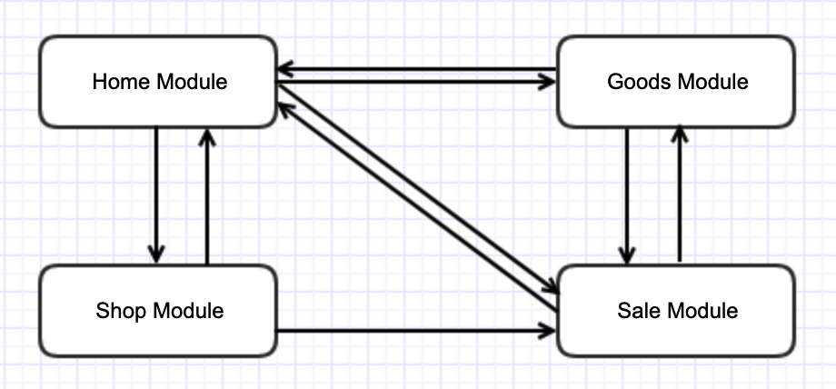
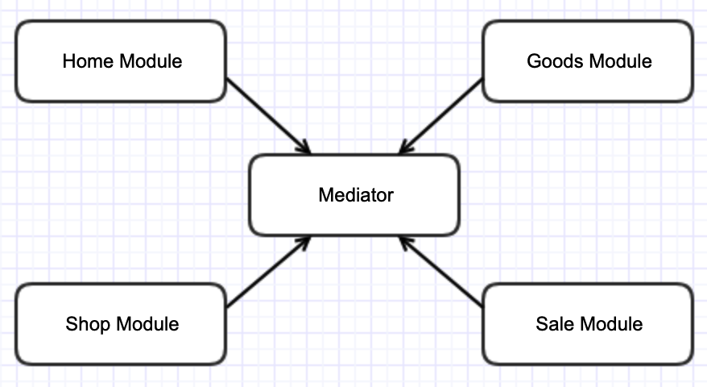
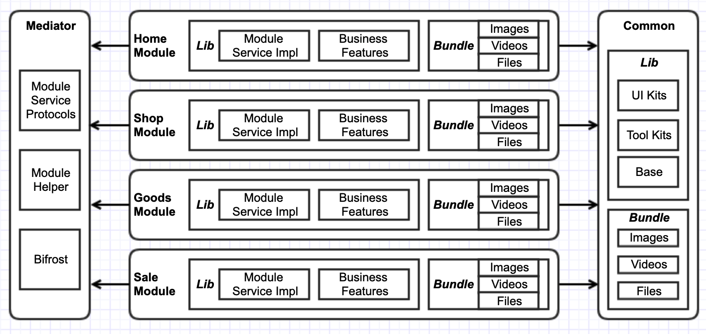

[](https://github.com/youzan/Bifrost/blob/master/LICENSE)&nbsp;
[](http://cocoapods.org/?q=Bifrost)&nbsp;
[](https://www.apple.com/nl/ios/)&nbsp;
[](https://www.apple.com/nl/ios/)&nbsp;
[](https://travis-ci.org/youzan/SigmaTableViewModel)

<p>
<a href="https://github.com/youzan/">
</p></a>
<p align="center">
    
</p>
<p align="center">A delightful library for app business modular architecture.</p>

[中文版README](https://doc.qima-inc.com/pages/editpage.action?pageId=12597462)

## What is Bifrost(/ˈbɪvrɒst/)
The Bifrost is a delightful library for App Business Modular Architecture. 
The name comes from the Myth of North Europe and the famous Marvel movie Thor. Bifrost is a rainbow bridge, by which People can reach anywhere in a moment.  

## Some Terms 
Firstly let's sync some terms we will use later.
### Business Module vs Function Module
Usually, we call a library for non-business functions **Function Module**, like AFN, SDWebImage, Masonry, ... They can be used across all kinds of apps and they have lot's of APIs. App needs to import their API declaration and invoke their API directly. And the **Business Module** contains lot's of business code, like the Goods Module, Trade Module, ... They can only be used in limited number of apps(sometimes only 1), and they only export a few of APIs or router urls because business module can't import any API declaration from other business modules.

### Code Dependency vs Business Dependency
The Code dependency means the dependency on code. If A module has code dependency on B module, A imports some API declarations from B. In other words, A module can't be built successfully without B module's code.
The Business Dependency means the business requirement on other modules. For example, if the Trade module needs to show a goods details page, it has business dependency on Goods module.
The Code dependency can be removed by Business Modular Architecture, but the business dependency always exists.

## Business Modular Architecture (BMA)
As an app becomes more and more complex, there will be quite a lot of dependencies between different business modules. One file is changed, so many files are affected. The development efficiency is affected. The purpose of BMAD is to remove all code dependency between different modules, so that our coding can be more efficient.
*NOTE: Not all projects needs BMA. A precondition should be that the project's business domains won't change too frequently. In other words, the app should be able to be divided to some stable modules first, then we can use BMA on it.*

Use the demo project as a sample. It contains 4 business modules: Home, Shop, Sale, Goods. Without BMA, it's module dependency relationship can be: 


And if with BMA, it's module dependency relationship will be


You can see, all business module won't have code dependency on each other. They only dependent on Common and Mediator module. Like the Sale module don't know the Goods module. It asks goods info from the Mediator. If Goods module registers itself on Mediator, Sale module can get goods info, if not, Sale module can't get goods info, but the Sale module still can be built successfully. In other words, the API error of Goods module won't affect the development of Sale module. 

## Usage
The Bifrost removes dependencies between different modules by 2 ways: **Router URLs** and **Remote APIs**. 
The Router URLs are often used to go to other UI pages. And the Remote APIs are used for non-UI actions or complex data delivery.
### Installation
It's recommended to use CocoaPods to install the Bifrost lib. Like this:
```
pod 'Bifrost'
```
### Router URL
Bifrost can bind a url string with a block. Simply, we can do the bind in the +load method.
```objective-c
//In GoodsDetailsViewController.m
+ (void)load {
//static NSString *const kRouteGoodsDetail = @"//goods/detail";
//static NSString *const kRouteGoodsDetailParamId = @"id";
//Above router url and param id are defined somewhere to avoid hardcoding
    [Bifrost bindURL:kRouteGoodsDetail toHandler:^id _Nullable(NSDictionary * _Nullable parameters) {
        GoodsDetailsViewController *vc = [[self alloc] init];
        vc.goodsId = parameters[kRouteGoodsDetailParamId];
        return vc;
    }];
}
```
And to invoke the URL by
```objective-c
//static NSString *const kRouteGoodsDetail = @"//goods/detail";
//static NSString *const kRouteGoodsDetailParamId = @"id";
//Above router url and param id are defined somewhere to avoid hardcoding
NSString *routeURL = BFStr(@"%@?%@=%@", kRouteGoodsDetail, kRouteGoodsDetailParamId, goods.goodsId);
UIViewController *vc = [Bifrost handleURL:routeURL];
if (vc) {
        [self.navigationController pushViewController:vc animated:YES];
}
```
Bifrost will parse the parameters in the url and put them in the *parameters* argument of the handler of the *bindURL:toHandler:* method.
If a complex parameter which can't be put in the router url, like an image object, we can use following method:
```objective-c
/**
 The method to handle URL with complex parameters and completion block
 
 @param urlStr URL string
 @param complexParams complex parameters that can't be put in the url query strings
 @param completion The completion block
 @return the returned object of the url's BifrostRouteHandler
 */
+ (nullable id)handleURL:(nonnull NSString *)urlStr
           complexParams:(nullable NSDictionary*)complexParams
              completion:(nullable BifrostRouteCompletion)completion;
```
The *completion* parameter in above method is used to do callback of the router url. It will be put in the *parameters* with the key *kBifrostRouteCompletion*
### Remote API
Also router url can meets most of the requirement, including those with  complex parameters, but it's not convenient. So we still need to use remote api to do method invocation directly. 
Like the Goods module provide following service:
```objective-c
//In GoodsModuleService.h
@protocol GoodsModuleService <NSObject>
- (NSInteger)totalInventory;
- (NSArray<id<GoodsProtocol>>*)popularGoodsList; //热卖商品
- (NSArray<id<GoodsProtocol>>*)allGoodsList; //所有商品
- (id<GoodsProtocol>)goodsById:(nonnull NSString*)goodsId;
@end
@protocol GoodsProtocol <NSObject>
- (NSString*)goodsId;
- (NSString*)name;
- (CGFloat)price;
- (NSInteger)inventory;
@end
```
(Above declaration is in the file GoodsModuleService.h in the Mediator project in the demo.)
Goods Module need to implement a *GoodsModule* class to conform above *GoodsModuleService* and provide implementation. The *GoodsModule* class should also conform to protocol *BifrostModuleProtocol*, so that it can be recognized by the Bifrost. 
The GoodsModule should also regitster itself, simply, in the +load method:
```objective-c
@implementation GoodsModule
+ (void)load {
    BFRegister(GoodsModuleService);
}
...
@end
```
Then wen can invoke those API in *GoodsModuleService* like this:
 ```objective-c
 //In file ShoppingCartViewController.m in the demo
- (CGFloat)totalPrice {
    CGFloat totalPrice = 0;
    for (ShoppingCartItem *item in self.shoppingCartItemList) {
        id<GoodsProtocol> goods = [BFModule(GoodsModuleService) goodsById:item.goodsId];
        totalPrice += goods.price * item.num;
    }
    return totalPrice;
}
 ```
 
## What's More
### The Architecture of The Whole Project
The BMA lib (Bifrost) is only a small part of the Business Modular Arch. More work is to refactor the project‘s architecture to conform the BMA requirement: Different business modules can't have code dependency on each others. 
The following arch used in the demo project is suggested:

There are 3 parts in the App: **Business Modules**, **Common Module** and **Mediator**.
Each Business module has 2 targets : static lib for code, and a bundle for resource. Business module put all its public API and router URLs in a **ModuleService** file. This ModuleService is put in the **Mediator** project, so that other business module can see these declarations. 
The business module provides implementation for its ModuleService.
You can find more details in the demo project.
### Performance
You may worry about the launch performance because we put quite a lot register code in the +load method. In fact the code for Bifrost in +load method is quite simple.
I did a test to register 10000 router urls and 100 modules. It only cost another 60 ms.
```
//Get App pre-main time by Xcode's DYLD_PRINT_STATISTICS settings
//Without test code
Total pre-main time: 344.82 milliseconds (100.0%)
         dylib loading time: 171.59 milliseconds (49.7%)
        rebase/binding time:  36.06 milliseconds (10.4%)
            ObjC setup time: 102.27 milliseconds (29.6%)
           **initializer time:  34.74 milliseconds (10.0%)**
//With test code to register 10000 router urls and 100 modules
Total pre-main time: 366.12 milliseconds (100.0%)
         dylib loading time: 179.28 milliseconds (48.9%)
        rebase/binding time:  29.32 milliseconds (8.0%)
            ObjC setup time:  63.77 milliseconds (17.4%)
           **initializer time:  93.50 milliseconds (25.5%)**
//Note: the +load method mainly affects the initializer time.
```
In facts, One app may only contains 20-50 modules and 200-300 Routers. If you still want to save the time, you can try to put the binding code to some places after app launching.

### Why do We Need Router URL?
It seems the Remote API is more powerful than router url. Why not only to use remote api? Like Ali's Beehive lib only provides the support for remote API. The main reason is that sometimes we need a way also can be used in other platform, like h5 page and android. And it's very convenient to use URL to go to another page. So Bifrost also supports router URLs.
